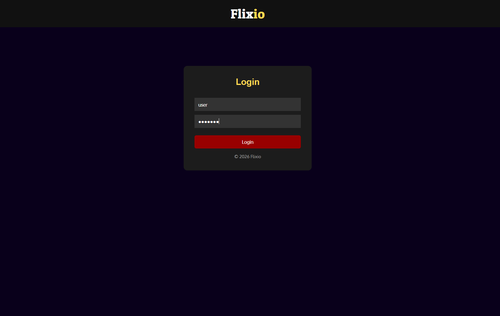
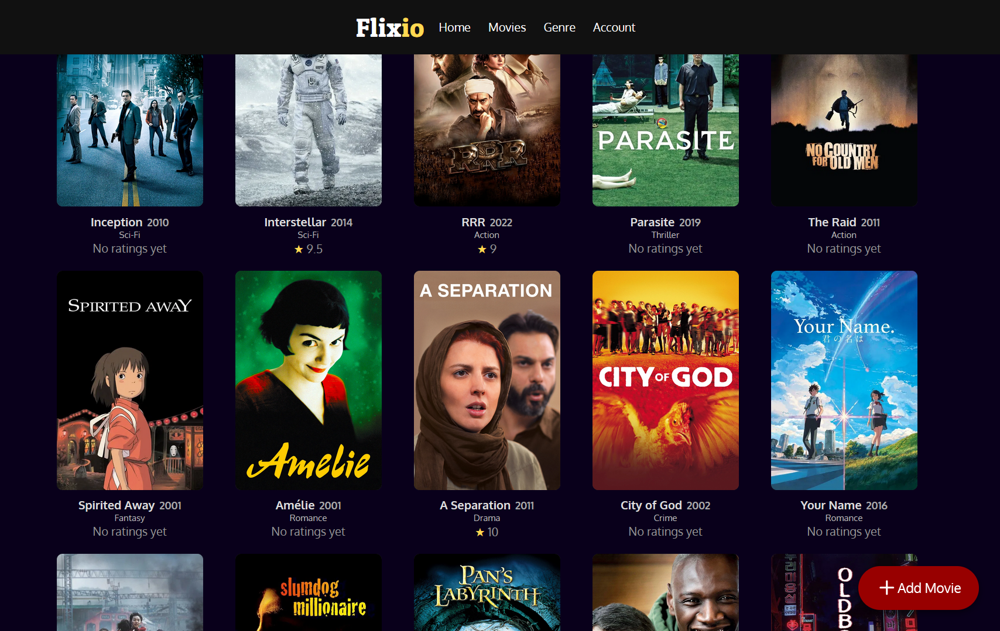
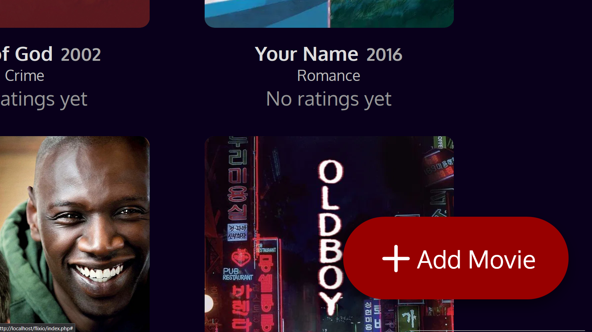
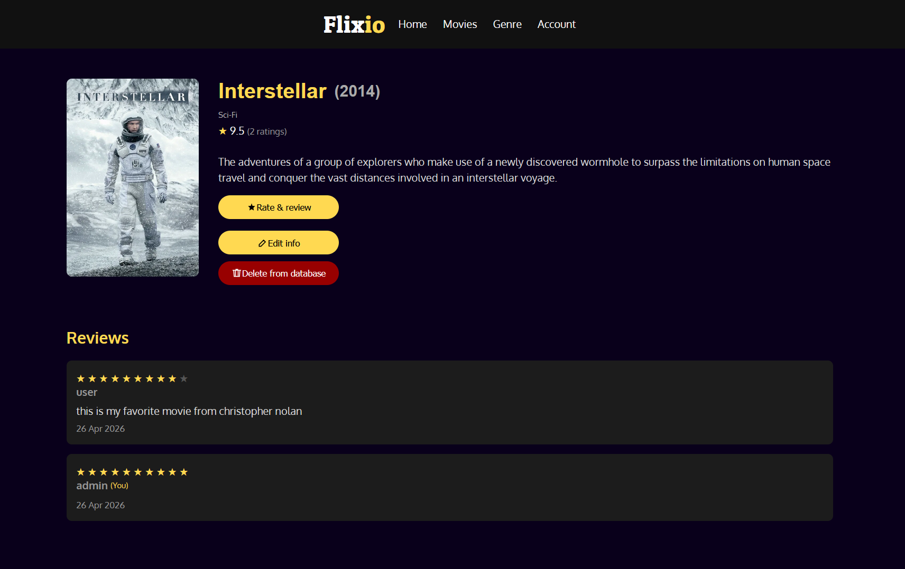
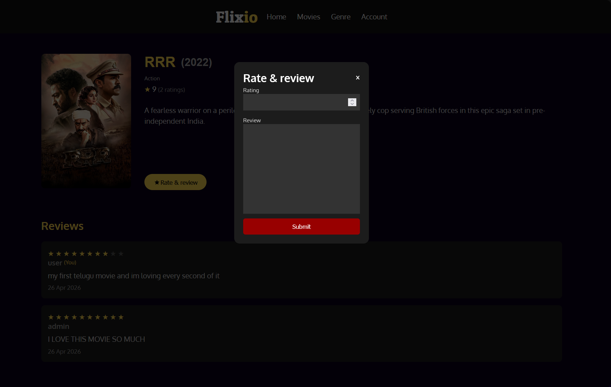

# Flixio
Simple movie web app built with PHP & MySQL. A work in progress; currently adding more features.

## Setup
1. Import database.sql
2. Run docker compose up
3. Access http://localhost:8080

## Default Users
Admin:
- username: admin
- password: admin123
User:
- username: user
- password: user123
(passwords are hashed in database)

## Features

- Log in (admin/user roles)

- Dashboard with movie list

- Add movie (admin)

- Edit movie (admin)
- Delete movie (admin)

- Add rating & review

## Tech Stack
- PHP
- MySQL
- CSS
- JavaScript
